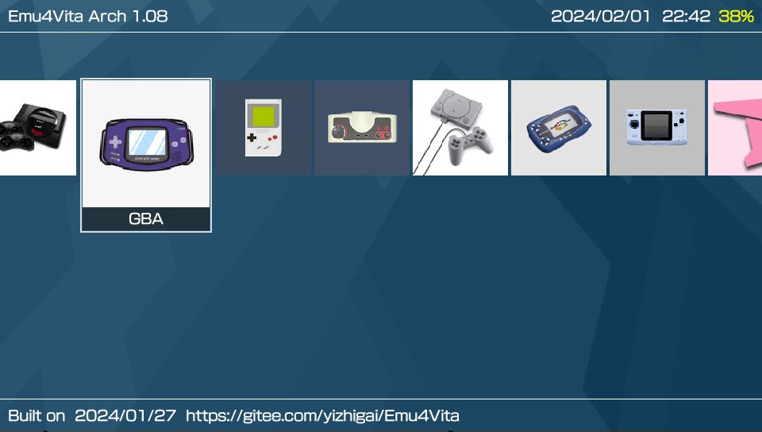
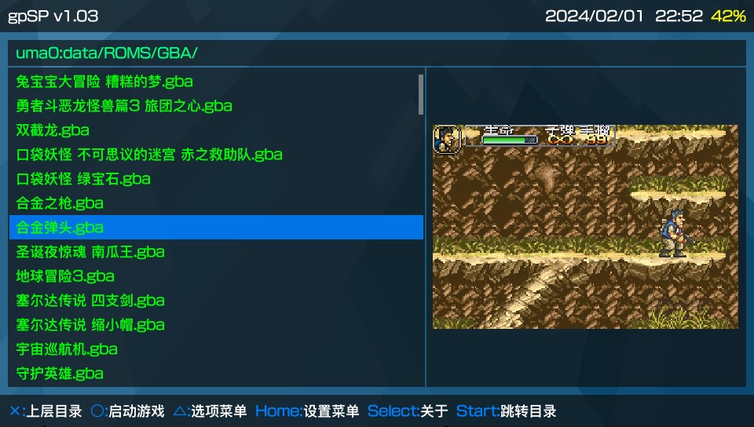
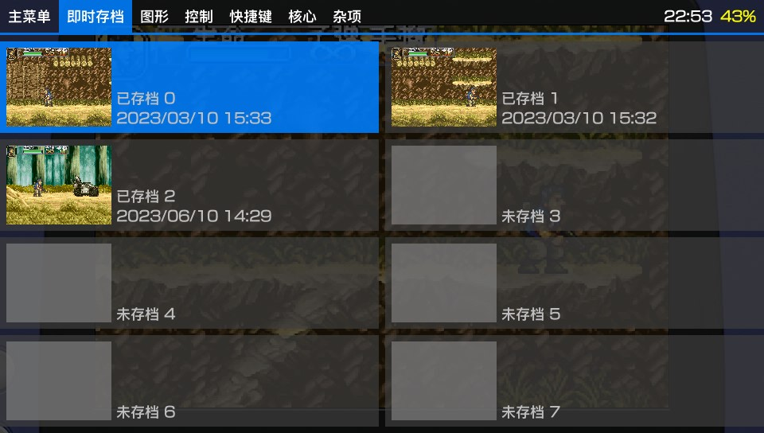
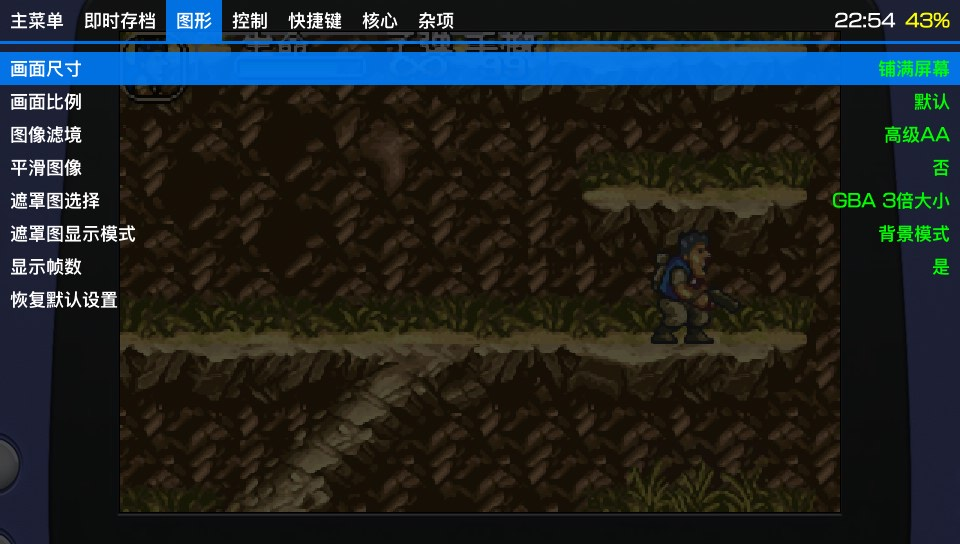

# Emu4Vita

## 简介

一个使用[Libretro](https://github.com/libretro) API的Mini前端，目前只支持psvita。

## 支持平台

* Sony Ps Vita

## 开发人员

* 一直改
* noword
* ......

## 如何编译

需要安装好[Vitasdk](https://github.com/vitasdk)，并克隆好项目以及所有子模块。

可在根目录编译所有核心的vpk，也可进入apps文件下的核心文件夹内单独编译,
执行make即可，会自动编译好所需的一切。

## 感谢人员

[Vitasdk](https://github.com/vitasdk) contributors.

[Libretro](https://github.com/libretro) for core and API.

[TheFlow](https://github.com/TheOfficialFloW) for some snippets i used and some ideas i borrowed.

[xerpi](https://github.com/xerpi) for vita2d.

[frangarcj](https://github.com/frangarcj) for vitashaders.

[水原ありさ](https://space.bilibili.com/3476) for 图片素材等.

感谢不知名的网友提供的素材，如遮罩图，背景图等。
感谢百度psvita破解吧的吧主lxg好费劲以及众多吧友。
需要感谢的太多，无法一一描述，待补充，请见谅。
若一些素材或其它有版权问题不允许使用的可联系处理。

## 程序截图

|                                                 |                                                 |
| :---------------------------------------------: | :---------------------------------------------: |
|  |  |
|  |  |